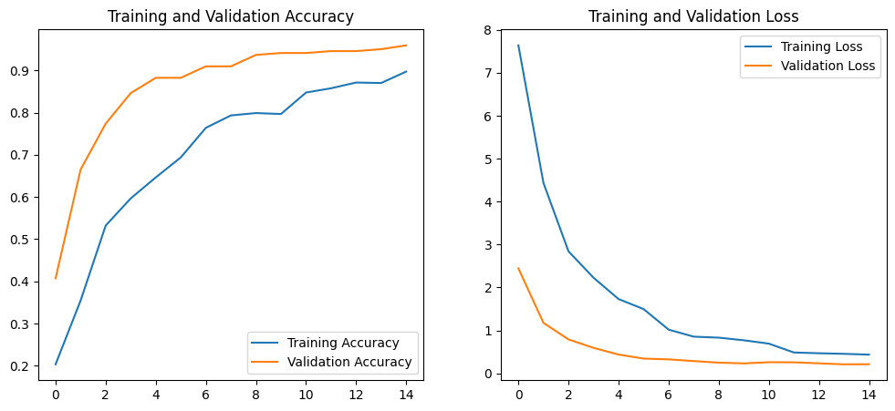

# AI-Powered Skin Disease Classification 🩺

This repository contains the code and resources for a deep learning project focused on classifying common skin diseases from images. This project leverages the power of **Transfer Learning** with a pre-trained Convolutional Neural Network (CNN) to achieve high accuracy even with a limited dataset.

This project is intended for educational and research purposes to demonstrate the potential of AI in the healthcare domain.


---

## 📖 Project Overview

The primary goal of this project is to build and train a model capable of distinguishing between **8 different types of skin infections**, including viral, bacterial, and fungal categories. Given an image of a skin rash, the model predicts the most likely condition, providing a valuable tool for preliminary analysis.

### ✨ Key Features:
- **Classification of 8 Skin Conditions:** The model can identify Cellulitis, Chickenpox, Impetigo, Athlete's Foot, Nail Fungus, Ringworm, Cutaneous Larva Migrans, and Shingles.
- **High Accuracy:** Achieved a validation accuracy of approximately **94%** by leveraging a pre-trained model.
- **Built with TensorFlow/Keras:** Implemented using industry-standard deep learning frameworks.
- **Transfer Learning Approach:** Utilizes the **VGG16** model, pre-trained on the ImageNet dataset, to overcome the challenge of a small dataset.

---

## 🚀 Technologies Used

- **Frameworks & Libraries:**
  - TensorFlow
  - Keras
  - NumPy
  - Matplotlib
- **Model Architecture:** VGG16 (Pre-trained)
- **Development Environment:** Google Colab (`.ipynb`)

---

## 📈 Results

The model was trained for 15 epochs and demonstrated excellent performance. The training history shows a consistent decrease in loss and an increase in accuracy, without significant signs of overfitting.




The high validation accuracy compared to the training accuracy is a known and positive side-effect of using Dropout layers, which are only active during training.

---

## ⚙️ How to Use This Notebook

To run this project yourself, follow these steps:

1.  **Clone the Repository:**
    ```bash
    git clone https://github.com/WAPunsisiYemaniPerera/Skin-Disease-Detector.git
    ```

2.  **Prepare the Dataset:**
    - Download a suitable skin disease dataset. The one used for this project contained 8 classes.
    - Organize the images into separate folders, with each folder named after the class it represents.

3.  **Open in Google Colab:**
    - Upload the `.ipynb` file to your Google Colab environment.
    - Upload your dataset (as a `.zip` file) and use the provided code to unzip it within the Colab session.

4.  **Run the Cells:**
    - Execute the cells in the notebook sequentially to preprocess the data, build the model, and start the training process.

---

## ⚠️ Disclaimer

This project is an academic exercise and **is not a substitute for professional medical advice, diagnosis, or treatment.** The predictions made by this model should not be used for self-diagnosis. Always seek the advice of a qualified physician or other healthcare provider with any questions you may have regarding a medical condition.
